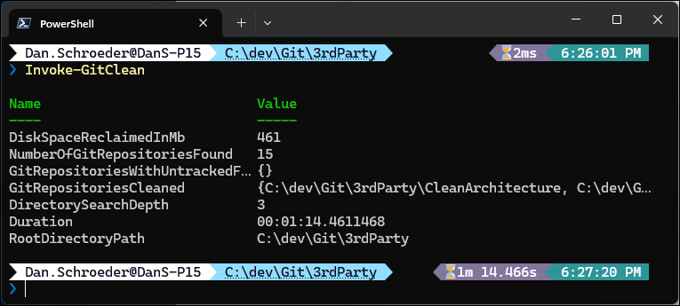
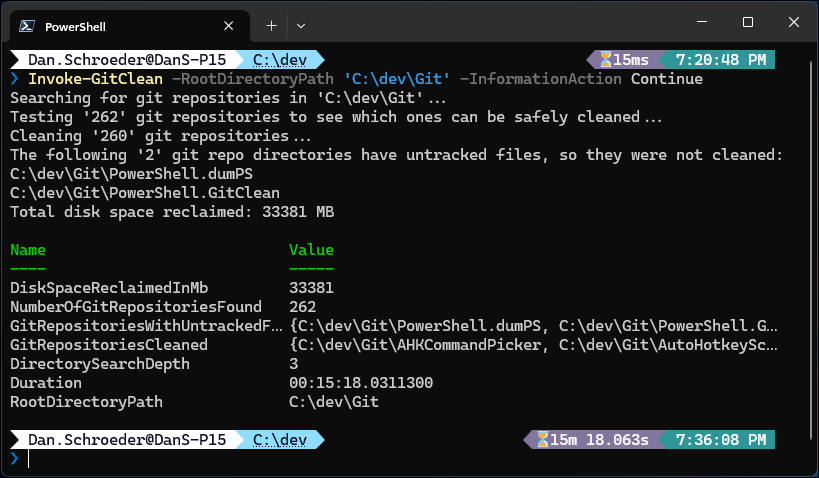

<p align="center">
  <a href="https://github.com/deadlydog/PowerShell.GitClean/actions/workflows/build-and-test-powershell-module.yml"></a>
  <a href="https://github.com/deadlydog/PowerShell.GitClean/actions/workflows/build-test-and-deploy-powershell-module.yml"></a>
  <a href="https://github.com/deadlydog/PowerShell.GitClean/blob/main/License.md"></a>
  <a href="https://github.com/deadlydog/PowerShell.GitClean/blob/main/docs/Contributing.md"></a>
</p>

<p align="center">
  <a href="https://www.powershellgallery.com/packages/GitClean"></a>
  <a href="https://www.powershellgallery.com/packages/GitClean"></a>
  <a href="https://www.powershellgallery.com/packages/GitClean"></a>
</p>

<p align="center">
  <!-- Must add 'Windows', 'MacOS', and 'Linux' to the module manifest tags for them to show up on the Platforms badge. -->
  
  
  
</p>

# GitClean PowerShell Module

## 💬 Description

GitClean is a cross-platform PowerShell module that provides an `Invoke-GitClean` cmdlet (with a `Git-Clean` alias) to easily perform a [git clean -xfd](https://git-scm.com/docs/git-clean) on all git repositories under a specified directory in order to free up disk space.
Git repositories with untracked files will not be cleaned by default, to avoid losing any work that has not yet been committed.

## ❓ Why this exists

Developers often have 10s or 100s of git repositories cloned on their local machine.
We don't always remember to clean up build artifacts and temporary files when we are done, such as NuGet packages and node_modules.
These files can take up a lot of space on your hard drive.
This module provides a simple way to clean up all of your git repositories at once, allowing you to reclaim potentially GBs of disk space.

## 🖼️ Screenshots

Here is a screenshot of running `Invoke-GitClean` with no parameters, so it scans the current directory and subdirectories for git repositories and cleans them:



It found and cleaned 15 git repositories, reclaiming 461 MB of disk space in 1 minute and 14 seconds.

Here is an example of explicitly providing the root directory path to scan for git repositories and displaying additional informational messages:



It found 262 git repositories, 2 of which had untracked files so they were not cleaned.
By cleaning the other 260, it reclaimed 33.4 GB of disk space in 15 minutes and 18 seconds.

## 🚀 Quick start

To install the module from the PowerShell Gallery, run the following command:

```powershell
Install-Module -Name GitClean -Scope CurrentUser
```

To clean all git repositories under a specified directory, run the following command:

```powershell
Invoke-GitClean -RootDirectoryPath 'C:\path\to\repositories'
```

This assumes that there are multiple git repositories under the specified root directory.

> [!NOTE]
> __GitClean puts safety first:__ To avoid accidentally deleting files that have not yet been committed to git, this cmdlet will only clean repositories that have no untracked files.
> This ensures you don't lose any work that you haven't committed yet.
> Use the `-Force` parameter to bypass this safety check.

## 📖 Usage

This module only provides one cmdlet: `Invoke-GitClean`

It accepts the following parameters:

- `RootDirectoryPath`: The root directory to search for git repositories in. If not provided, the current directory will be used. Alias: `Path`
- `DirectorySearchDepth`: The depth to search for git repositories under the `RootDirectoryPath`. A large value may increase the time it takes to discover git repositories. Default is 3. Alias: `Depth`
- `Force`: If provided, all git repositories will be cleaned, even if they have untracked files. __Be careful with this switch!__

The following common parameters are also supported:

- `WhatIf`: If provided, the cmdlet will not actually delete any files. It will only show you which repos would be cleaned, even if `-Force` is provided.
- `Confirm`: If provided, the cmdlet will prompt you to confirm before cleaning each repository.
- `InformationAction`: If provided, the cmdlet will output general information about what it is doing.
- `Verbose`: If provided, the cmdlet will output verbose information about what it is doing.

The cmdlet returns a PSCustomObject with the following properties:

- `RepositoryPath`: Path that was used to run the command.
- `DirectorySearchDepth`: Depth that was used to run the command.
- `NumberOfGitRepositoriesFound`: Number of git repositories that were found.
- `GitRepositoriesCleaned`: Array of the git repository directory paths that were cleaned.
- `GitRepositoriesWithUntrackedFiles`: Array of the git repository directory paths that were not cleaned due to having untracked files.
- `Duration`: How long the operation took to complete.
- `DiskSpaceReclaimedInMb`: The amount of disk space in megabytes that was reclaimed by the git clean operations.

`Invoke-GitClean` also has the following aliases:

- `Clean-GitRepositories`
- `Git-Clean`

### Examples

Clean all git repositories under the current directory:

```powershell
Invoke-GitClean
```

---

Clean all git repositories under the current directory, using an `Invoke-GitClean` alias:

```powershell
Clean-GitRepositories
```

or

```powershell
Git-Clean
```

---

Do not clean any repositories, but show which ones would be cleaned:

```powershell
Invoke-GitClean -RootDirectoryPath 'C:\path\to\repositories' -WhatIf
```

---

Clean all repositories, even if they have untracked files:

```powershell
Invoke-GitClean -Path 'C:\path\to\repositories' -Force
```

---

Prompt the user for confirmation before cleaning each repository, and use the `Git-Clean` alias:

```powershell
Git-Clean -Path 'C:\path\to\repositories' -Confirm
```

---

With repositories at the following paths:

- `C:\path\to\repositories\repo1`
- `C:\path\to\repositories\repo2`
- `C:\path\to\repositories\OtherRepos\repo3`
- `C:\path\to\repositories\OtherRepos\repo4`
- `C:\path\to\repositories\OtherRepos\MoreRepos\repo5`

Only clean `repo1` and `repo2`:

```powershell
Invoke-GitClean -Path 'C:\path\to\repositories' -Depth 1
```

And to only clean `repo1`, `repo2`, `repo3`, and `repo4`:

```powershell
Invoke-GitClean -Path 'C:\path\to\repositories' -Depth 2
```

---

List all git repositories that were not cleaned because they have untracked files:

```powershell
$result = Invoke-GitClean -Path 'C:\path\to\repositories'
$result.GitRepositoriesWithUntrackedFiles
```

---

Show general and verbose information about what the cmdlet is doing:

```powershell
Invoke-GitClean -Path 'C:\path\to\repositories' -InformationAction Continue -Verbose
```

## ➕ How to contribute

Issues and Pull Requests are welcome.
See [the Contributing page](docs/Contributing.md) for more details.

## 📃 Changelog

See what's changed in the application over time by viewing [the changelog](Changelog.md).

## ❤️ Donate to support this project

Buy me a milkshake for providing this PowerShell module open source and for free 🙂

[](https://www.paypal.com/cgi-bin/webscr?cmd=_s-xclick&hosted_button_id=VTQ5C7APCHN3E)
